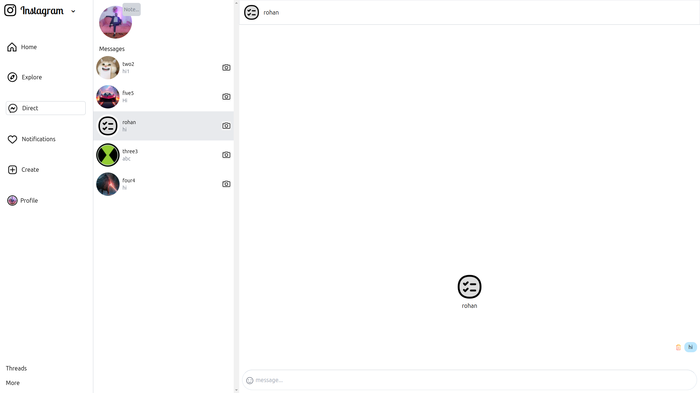
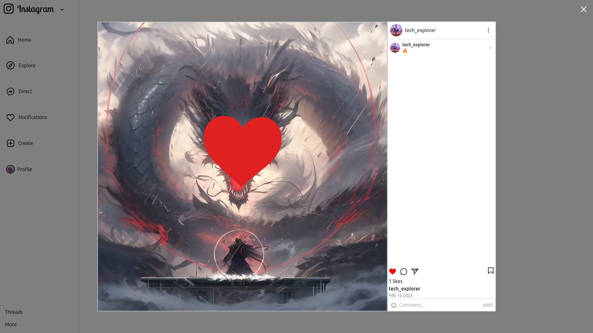

# Instagram Clone - Frontend

This is the **frontend** of an Instagram Clone built using **React.js**. It provides features like authentication, posts, likes, comments, following, real-time messaging, and notifications.

## 🚀 Features
- User authentication (Signup, Login, Logout)
- Create, like, and comment on posts
- Follow/unfollow users
- Real-time chat using Socket.io
- Notifications for likes, comments, and follows
- Profile page with posts and user details
- infinite scrolling on home, explore and profile pages
- Responsive UI

## 🛠️ Tech Stack
- React.js
- Redux (for state management)
- Tailwind CSS (for styling)
- Socket.io (for real-time messaging)
- Axios (for API requests)

## 📷 Project Preview
- Login Page

- Home Page

- Explore Page

- Direct Messages Page
 

- Notification Page

- Profile page

- Create Post Page
 
 

- Post Page
 
 
 

Also checkout Backend part
[Visit Github Repository of Backend](https://github.com/gourav247365/Instagram-Clone-Bakend)